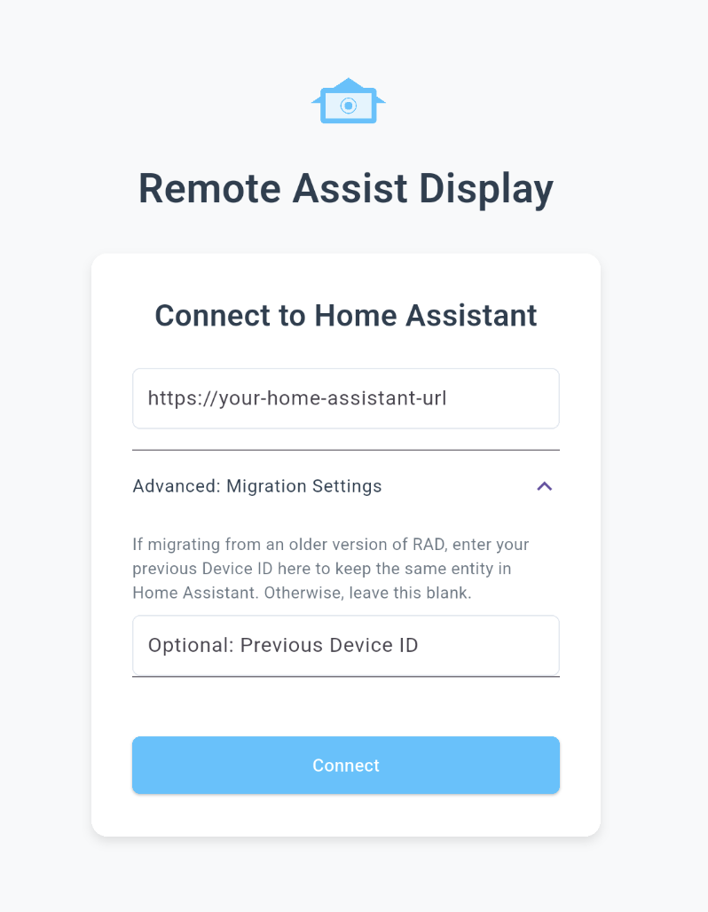

# Remote Assist Display Cross-Platform

[](https://github.com/michelle-avery/rad-cross-platform/actions/workflows/build_release.yml)

A Flutter-based companion display application for [Home Assistant](https://www.home-assistant.io/).

## Overview

This application serves as a dedicated display for your Home Assistant dashboards. Together with the [integration](https://github.com/michelle-avery/remote-assist-display), it registers itself as a controllable display device with your Home Assistant instance, allowing you to remotely change the displayed dashboard or URL via WebSocket commands.

The primary goal is to provide a performant, cross-platform solution, replacing the original Python/Kivy-based RAD application.

## Core Functionality

- Displays Home Assistant dashboards in a fullscreen/kiosk-like webview.
- Connects to a specified Home Assistant instance using OAuth2 authentication.
- Establishes a persistent WebSocket connection to receive commands.
- Allows remote navigation between dashboards or specific URLs.
- Updates Home Assistant with its current status (e.g., displayed URL).

## Prerequisites

Before using this application, you **must** install the corresponding **Remote Assist Display integration** in your Home Assistant instance. You can find it here:

- **[Remote Assist Display Home Assistant Integration](https://github.com/michelle-avery/remote-assist-display)**

Follow the installation instructions provided in that repository.

## Target Platforms

- **Android:** Mobile/Tablet devices.
- **Linux:** Desktop environments, specifically built on ARM64 devices running Alpine Linux (musl libc). Support for other distributions and systems, particularly the raspberry pi, is planned for future releases. If you're interested in contributing to this, please reach out.

## Installation

### Android

1.  Download the latest `radcxp-android-apk/app-release.apk` file from the [Releases Page](https://github.com/michelle-avery/rad-cross-platform/releases).
2.  Install the APK on your Android device. You may need to enable installation from unknown sources.

### Linux (ARM64 - Alpine/musl)

This build is specifically tailored for ARM64 devices running Linux distributions using the musl C library, such as Alpine Linux or postmarketOS.

**Prerequisites:**

Ensure you have the necessary runtime libraries installed on your system. Package names may vary depending on your distribution:

- **GTK 3:**
    - Alpine: `apk add gtk+3.0`
- **WebKitGTK (4.1):**
    - Alpine: `apk add webkit2gtk-4.1`

**Installation Steps:**

1.  Download the latest `radcxp-linux-arm64-alpine-musl-vX.Y.Z.tar.gz` file from the [Releases Page](https://github.com/YOUR_USERNAME/rad-cross-platform/releases).
2.  Extract the archive:
    ```bash
    tar -xzvf radcxp-linux-arm64-alpine-musl-vX.Y.Z.tar.gz
    ```
3.  Navigate into the extracted directory:
    ```bash
    cd remote_assist_display_cxp
    ```
4.  Run the installation script:
    ```bash
    sh install.sh
    ```
    This script will:
    - Make the `radcxp` binary executable.
    - Create a wrapper script `start-radcxp` that sets up the necessary environment variables (including specific ones for postmarketOS).
    - Ask if you want to configure the application to start automatically on login (creates a `.desktop` file in `~/.config/autostart/`).

## Usage

1.  **First Run:**
    *   Launch the application (either via the `start-radcxp` script, or rebooting if autostart was enabled.
    *   You will be prompted to enter the URL of your Home Assistant instance (e.g., `https://homeassistant.your-domain.org`).
    * If you're upgrading from the original Python/Kivy version of RAD, you can optionally expand the "Advanced: Migration Settings" section and manually set the unique ID of the device to match the one used in the previous version. This will allow you to retain your existing settings and configurations:
    
    *   The application will initiate the OAuth2 login flow with your Home Assistant instance. Log in and authorize the "Remote Assist Display" application.
2.  **Normal Operation:**
    *   The application will connect to Home Assistant and display your default dashboard in fullscreen mode.
    *   It will listen for commands from the `remote_assist_display` integration in Home Assistant.
3. **Adjusting Settings:**
    * On Linux, the main app window (usually in the background once the dashboard is displayed) contains the settings.
    * On Android, you can access the settings screen by tapping on the display with three fingers.
    * The settings page displays some diagnostic information and also allows you to change the log level.

**Note for postmarketOS Users (Manual Start via SSH):**

If you run the application manually via SSH (e.g., `ssh user@device './remote_assist_display_cxp/start-radcxp'`) and it doesn't appear on the device's display, you might need to set the `XDG_RUNTIME_DIR` environment variable first:

```bash
export XDG_RUNTIME_DIR="/run/user/10000" # Adjust user ID (10000) if necessary
./remote_assist_display_cxp/start-radcxp
```

## Building from Source

### Prerequisites

- Flutter SDK
- **Android:** Android SDK, NDK (as required by Flutter)
- **Linux:** Docker

### Commands

- **Get Dependencies:**
  ```bash
  flutter pub get
  ```
- **Build Android Debug APK:**
  ```bash
  flutter build apk --debug
  ```
- **Build Android Release APK:**
  ```bash
  flutter build apk --release
  ```

- **Build Linux ARM64 (using Docker):**
  ```bash
  chmod +x ./build_linux_arm.sh
  ./build_linux_arm.sh
  ```
  *(Output bundle will be in `./build/linux/arm64/release/release/bundle`)*
